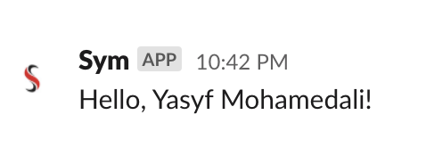

# Triggering Events

Let's test our our new subscription, by triggering an Event from the CLI, which will hit the Sym API. This should cause our `hello` flow run, resulting in us receiving a DM in Slack (from our `io.say`)!

To make things quicker later on, we'll create a little script to emit this event. Put the following in a script called `request.sh` and make it executable.

```bash
#!/bin/bash

BUCKET_ARN="arn:aws:s3:us-east-1:999999999:symdemo"

UUID=$(sym event create --flow=demo --name=BUCKET_ACCESS_REQUEST --bucket_arn=$BUCKET_ARN)

sym event status $UUID --format=json
```

The first call to `sym` will create an Event. The second will print a JSON summary of our new Event to your terminal.

Now run the script, and take a look at the output.

```bash
$ ./request.sh
```

```json
{
  "type": "event",
  "name": "BUCKET_ACCESS_REQUEST",
  "fqn": "event:symops:yasyfm:demo:BUCKET_ACCESS_REQUEST",
  "created_at": "2020-03-27T05:35:23",
  "uuid": "1830FD4C-2992-4083-B7EC-B0BE644EFC11"
}
```

If everything worked, the event was emitted, and you should now have a Slack DM from Sym!



**[Next: Codifying an Access Workflow](08_codifying_access.md)**
