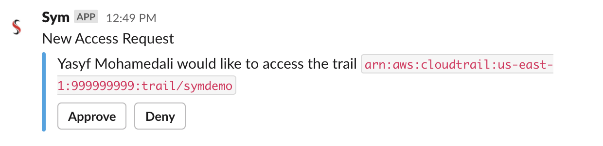

# Putting It All Together!

## Check Access

Let's first verify that we can't currently access the bucket.

```bash
$ aws s3 ls symdemo
```

```
An error occurred (AccessDenied) when calling the ListObjectsV2 operation: Access Denied
```

Looks like, as expected, we don't have access to that bucket.

## Deploy

Next, let's deploy our codified access workflow.

```bash
$ sym flow deploy demo
```

```
Checking for an existing flow...✅
Found flow "yasyfm:demo"!
Downloading current spec for "yasyfm:demo"...✅
Checking for new events...✅
No new events found!
Checking for a new flow definition...✅
Uploading "demo.symflow"...✅
Deploy of "demo" flow succeeded!
```

```bash
$ sym flow status demo --format=json
```

```json
{
  "name": "demo",
  "fqn": "flow:symops:yasyfm:demo",
  "last_update": "2020-03-27T05:35:00",
  "status": "ready",
  "flows": ["hello"],
  "subscriptions": ["poll:BUCKET_ACCESS_REQUEST"],
  "configs": ["channel"]
}
```

## Make Request

Now, let's run our script to kick off a request via Sym.

```bash
$ ./request.sh
```

```json
{
  "type": "event",
  "name": "BUCKET_ACCESS_REQUEST",
  "fqn": "event:symops:yasyfm:demo:BUCKET_ACCESS_REQUEST",
  "created_at": "2020-03-27T05:35:23",
  "uuid": "6A76A214-586B-4C63-960F-392650416796"
}
```

```
Waiting for output from workflows triggered by Event 6A76A214-586B-4C63-960F-392650416796...
.
.
.
```

At this point, we should see a Slack message in the `#eng` channel, requesting approval.



## Approve

Click "Approve", then tune back in to your terminal.

```
.
.
.
Received 1 `setenv`!

The AWS_SESSION_TOKEN environment variable has been set. You can now use the AWS CLI with the `SymDemoEscalated` Role.

If you need to use the AWS Console with this Role, please visit the following link: https://signin.aws.amazon.com/?token=xxx
```

Awesome, it worked! Let's test it out with the AWS CLI.

## Verify Access

```bash
$ aws s3 ls symdemo
```

```
2019-08-08 10:14:20      91503 access.log
2019-08-08 10:14:26   13110282 application.log
2019-06-07 12:46:08       5017 error.log
```

Success! We can now use commands such as `aws s3 cp` to download and dive into the logs.

**[Next: Up next](12_up_next.md)**
