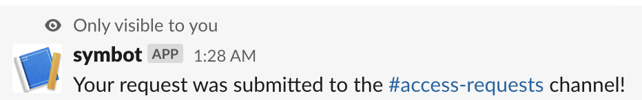

ID: infra_access
Summary: Sym Workflows turn tedious, manual compliance processes into executable workflow definitions that your ops teams can manage as code.
Feedback Link: mailto:founders@symops.io
Analytics Account: UA-156651818-3

# Sym Workflows: Infrastructure Access

## Welcome
Duration: 2:00

Hey! I'm [Yasyf](https://twitter.com/yasyf), CEO at [Sym](https://www.symops.io/). Today I want to walk you through setting up a simple ephemeral infrastructure access control as a Sym Workflow. If you want to learn more about how Sym can help you accomplish your compliance goals, please check out our [product overview datasheet](https://docsend.com/view/zkkr4s6a2tpct8n4).


### Context

Let's set up our use case. I'm an engineer at Healthy Health, a 100 person healthtech startup. We integrate with health systems, and in the process end up with lots of patient PHI, so we have to be HIPAA-compliant. Additionally, our customers require that we pass annual SOC 2 Type 2 audits, as well as routine vendor security assessments.

To increase the security and audibility of infrastructure access at Healthy Health, we've decided to put a peer-approval process around sensitive resources, with a low default access level, and short grants of escalated privileges upon approval. This happens to satisfy many of our compliance requirements, namely:

- **HIPAA Privacy Rule**: Minimum Necessary Requirement
- **HIPAA Security Rule**: Access Authorization, Unique User Identification, Automatic Logoff
-  **SOC 2**: Common Controls 4 (Monitoring Activities) and 6 (Logical and Physical Address)

### Workflow

Without Sym, we might decide to implement our approval and access workflow using JIRA tickets, and a single task queue that is owned by the SecOps team. This would require SecOps to manually review requests, escalate engineers, and revoke privileges at a later date. Such a workflow is prone to long turnaround times for engineers, wasted time for ops, and access drift as a result of forgotten grants.

With Sym, we can easily implement a compliant policy that distributes approvals and gets engineers short-lived access in seconds, while keeping ops out of the loop.

When you're done with this tutorial, you'll have a smooth approval flow that you can initiate from your command line, with approvals granted via a message in a Slack channel, and fully-automated privilege escalations.

If you'd rather jump straight into the code, you can find it on GitHub at [symopsio/walkthrough](https://github.com/symopsio/walkthrough/tree/master/infra_access).

## Environment Setup
Duration: 3:00

For the purposes of this tutorial, we'll assume that your company has already set up Sym at an organizational level. This includes integrating with your IDP to obtain a user mapping.

To complete this tutorial, you should [install Terraform](https://learn.hashicorp.com/terraform/getting-started/install), and make sure you have a working install of Python 3.

You'll also need an escalation strategy. An escalation strategy is how we tell Sym what to do when an access request has been approved. The easiest way to get Sym up and running is to have an AWS IAM Group whose members can assume a privileged role. We'll walk you through this if you don't already have it set up. Sym also supports escalation via Okta, and any custom lambda via our [Serverless Templates](https://github.com/symopsio/serverless-templates).

If you'd like to play around with connecting Okta with IAM for SSH, you should check out our [`terraform-okta-ssm-modules`](https://github.com/symopsio/terraform-okta-ssm-modules) posts.

## AWS IAM Setup
Duration: 5:00

Positive
: *You can skip this step if you already have an escalation strategy in place.*

Let's create a sample escalation strategy for use in this tutorial. Please login to the AWS Console and complete the following steps.

1. Create an IAM Role named `SymDemoEscalated`.
2. In your terminal, run `aws iam get-role --role-name SymDemoEscalated`.
   Note the `RoleId`, which should begin with `AROA`.
3. Create an S3 bucket named `SymDemo-YourNameHere`, and attach the below **S3 Bucket Policy**, which restricts access to the `SymDemoEscalated` Role.
4. Create an IAM Group, `SymDemoAdmins`, and attach the below **IAM Group Policy**, which allows the group to assume the `SymDemoEscalated` Role.

Now, the only users who will be able to access our S3 bucket are the ones in the `SymDemoAdmins` IAM Group! This group will be our escalation strategy.

#### S3 Bucket Policy

```json
{
  "Version": "2012-10-17",
  "Statement": [
    {
      "Effect": "Deny",
      "Principal": "*",
      "Action": "s3:*",
      "Resource": [
        "arn:aws:s3:::SymDemo-YourNameHere",
        "arn:aws:s3:::SymDemo-YourNameHere/*"
      ],
      "Condition": {
        "StringNotLike": {
          "aws:userId": [
            "AROAEXAMPLEID:*"
          ]
        }
      }
    }
  ]
}
```

#### IAM Group Policy

 ```json
 {
     "Version": "2012-10-17",
     "Statement": [
       {
         "Effect": "Allow",
         "Action": "sts:AssumeRole",
         "Resource": "arn:aws:iam::ACCOUNT-ID:role/SymDemoEscalated"
       }
     ]
 }
 ```

## Creating a New Workflow
Duration: 2:00

Let's first install the Sym CLI helper.

```bash
$ brew install sym
```

```
==> Downloading https://homebrew.bintray.com/bottles/sym-3.04.mojave.bottle.tar.gz
######################################################################## 100.0%
==> Pouring sym-3.04.mojave.bottle.tar.gz
🍺  /usr/local/Cellar/sym/3.04: 65 files, 82.9KB
```

We'll have to login before we can do anything else. Sym also supports SSO, if your organization has set it up.

```bash
$ sym login
```

```
Sym Org: healthy-health
Username: yasyfm
Password: ************
MFA Token: ******

Success! Welcome, Yasyf. 🤓
```

Next, let's create a new Sym Workflow called `infra_access`. We'll use the `approval` template: one of many Sym-provided templates to explore.

```bash
sym flow new infra_access --template=hello-world
```

You'll notice that this creates a `infra_access` directory with two files: `infra_access.tf` and `infra_access.py`. The Terraform file is where we will declare the resources and configuration for this workflow, and the Python file is where we will put our custom workflow logic.

## Terraform Config
Duration: 5:00

Let's take a look at `infra_access.tf`.

Positive
: You can modify this file in your browser by launching a [Google Cloud Shell](https://ssh.cloud.google.com/cloudshell/editor?cloudshell_git_repo=https%3A%2F%2Fgithub.com%2Fsymopsio%2Fdocs&cloudshell_open_in_editor=infra_access.tf&cloudshell_working_dir=infra_access&cloudshell_tutorial=README.md).

```terraform
provider "sym" {
  org = "healthy-health"
}

resource "sym_flow" "infra_access" {
  handler = {
    parent = "sym:approval"
    hooks = file("infra_access.py")
  }

  meta = {
    strategies = sym_strategies.escalation_strategies
  }
}

resource "sym_strategies" "escalation_strategies" {
  // Add your escalation strategies here
}
```

The `sym` provider provides a `sym_flow` resource, which you can use to define a new Sym Workflow. There are two required keys, `handler` and `params`.

### Handler

The `handler` key defines the structure of the workflow. The `handler` must specify a parent template (in this case, `sym:approval`).

The `sym:approval` template gives the foundation for an approval workflow in Sym. There are three main steps in this flow: the request, the approval, and the escalation. These steps can be parameterized and customized to fit your needs.

The `handler` can also optionally specify `hooks`: a file with code that modifies the steps of the workflow. Our `hooks` will be defined in the `infra_access.py` file, which we will explore in the next section.

### Params

The `params` key supplies the declarative parameters for our workflow. The `sym:approval` template defines one required parameter, `strategies`, which provides the configuration for your escalation strategies. We will add a strategy here after exploring the `hooks`.

## Hooks, Reducers, & Actions
Duration: 5:00

Workflows in Sym are composed of a series of pre-defined steps. Sym has three imperative mechanisms for modifying the logic of a workflow: `@hook`, `@reducer`, and `@action`.

- **`hooks`** occur *before* key steps of the workflow, and offer the opportunity to bypass, short-circuit, or alter the flow of steps, by emitting `events`.
- **`reducers`** take the current state of the workflow as input, and return a single value (whose type depends on the specific reducer) to a given step.
- **`actions`** are opportunities to execute additional side effects *after* a step,

The `sym:approval` template defines five steps (`prompt`, `request`, `approval`, `escalate`, `denial`), each with an `on_*` hook, and a `after_*` action. The template also defines one `reducer`, `get_approver`, which must be supplied.

Let's take a look at `infra_access.py`.

Positive
: You can modify this file in your browser by launching a [Google Cloud Shell](https://ssh.cloud.google.com/cloudshell/editor?cloudshell_git_repo=https%3A%2F%2Fgithub.com%2Fsymopsio%2Fdocs&cloudshell_open_in_editor=infra_access.py&cloudshell_working_dir=infra_access&cloudshell_tutorial=README.md).

```python
from sym.annotations import hook, action, reducer
from sym import slack


@reducer
def get_approver(event):
    raise NotImplementedError


@hook
def on_prompt(event):
    """
    Executed before the requesting user is prompted for details about their request.
    """

    pass


@action
def after_prompt(event):
    """
    Executed after the requesting user is prompted for details about their request.
    """

    pass

...
```

As we expected, the hooks and actions are optional, but we are missing a required implementation for the `get_approver` hook. This makes sense—Sym needs to know where to route access requests!

## Implementing a Reducer
Duration: 3:00

Let's go ahead and implement `get_approver`. For the purposes of this demo, let's keep it simple and assume that we're okay with anyone on the Engineering team approving access requests.

```python
from sym import slack

@reducer
def get_approver(event):
    return slack.channel("#eng")
```

With this simple addition, we now only have one piece left for a working demo: the escalation strategy.

Negative
: **TODO: Okta group example**

## Escalation Strategies
Duration: 3:00

Let's hop back over to our `infra_access.tf` file.

In the `escalation_strategies` block, let's add a `aws_strategy` which allows the user to escalate via the IAM Group (`SymDemoAdmins`) we set up earlier.

```terraform
resource "sym_strategies" "escalation_strategies" {
  aws_strategy {
    id = "aws"
    label = "AWS"
    allowed_values = ["SymDemoAdmins"]
  }
}
```

That's all!

Negative
: **TODO: Okta & Lambda example**

## Validating a Workflow
Duration: 2:00

There are two steps to validating your workflow locally. First, we can validate our Terraform config.

```bash
$ terraform validate
```

```
Success! The configuration is valid.
```

Next, we can lint and validate our Python code. Sym's CLI has a `validate` command to help with this.

```bash
$ sym validate
```


```
✅No Python syntax errors!
✅All required hooks and reducers are implemented!
✅All references exist and are valid!
```

## Testing a Workflow
Duration: 5:00

Sym integrates with Python's `unittest` library to allow for easy testing of workflows.

Negative
: **TODO: Write me**

## Deploying a Workflow
Duration: 3:00

Deploying a workflow with Sym's Terraform provider is simple: just run `terraform init && terraform apply`.

Terraform will create a Workflow in Sym, and upload the config and Python code associated with it. It will also create a cross-account Role in your AWS account for Sym to assume in order to move users into and out of the `SymDemoAdmins` IAM Group. The ARN for this role will automatically be saved in Terraform's outputs, and sent to Sym.

Negative
: **TODO: output of `terraform apply`**

## Triggering a Workflow
Duration: 3:00

We can test our new workflow by using the Sym CLI to create an event in the Sym API. This will cause `infra_access` to run end-to-end, so get ready to check Slack!

```bash
sym flow trigger --name=infra_access
```

```json
{
  "type": "event",
  "name": "TRIGGER_INFRA_ACCESS",
  "fqn": "event:symops:yasyfm:infra_access:TRIGGER_INFRA_ACCESS",
  "created_at": "2020-03-27T05:35:23",
  "uuid": "1830FD4C-2992-4083-B7EC-B0BE644EFC11"
}
```

If everything worked, the event was emitted, and you should now have a Slack DM from Sym!

### Prompt


Select the `SymDemoAdmins` group from the modal, then click "Next".



### Request

You should now see an approval request appear in the `#eng` channel.


### Approval

Get someone else to click the "Approve" button—it won't work if you try to approve yourself!

Negative
: **TODO: Success screenshot**

Nice, we did it! You've successfully completed the core of the tutorial. Read on if you want to explore some of Sym's more powerful features.

For example, by default, your user will stay in the escalated group for one hour. Our later sections walk through how to add an expiration field to the request modal, and use it in a reducer.

## Slack Shortcuts

Negative
: **TODO: Write me**

## Dynamic Expiration

Negative
: **TODO: Write me**

## Auto-Escalation (PagerDuty)

Negative
: **TODO: Write me**
